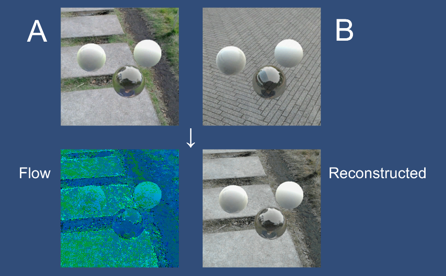

# PatchMatch-Unity
GPU implementation of Patch Match in Unity using Compute Shader

## License
- MIT License

## Tested Environment
- Unity 2017.4.9f1
- Windows 10 Pro (Version: 1803, OS build: 17134.345)
- NVIDIA GeForce GTX 970

## References
- PatchMatch GPU implementation using CUDA
    - https://github.com/rozentill/PatchMatch

- PatchMatch: A Randomized Correspondence Algorithm for Structural Image Editing (2009)
    - [Project Page](https://gfx.cs.princeton.edu/pubs/Barnes_2009_PAR/index.php)
    - [Paper](https://gfx.cs.princeton.edu/pubs/Barnes_2009_PAR/patchmatch.pdf)

- 参考書庫 sanko-shoko.net
    - [PatchMatch: A Randomized Correspondence Algorithm for Structural Image Editing
](http://www.sanko-shoko.net/note.php?id=jnzb)
